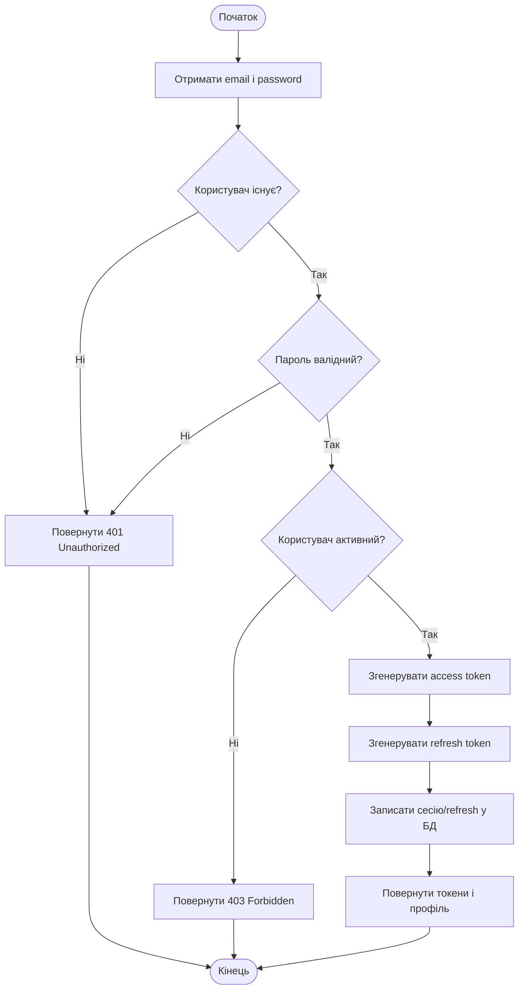
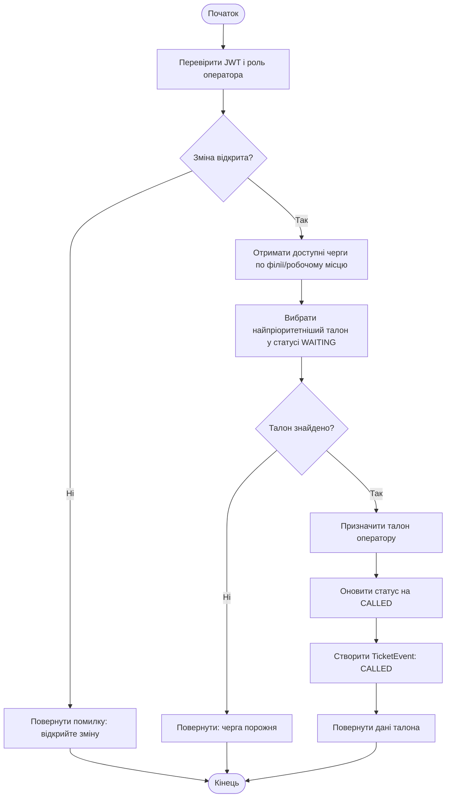
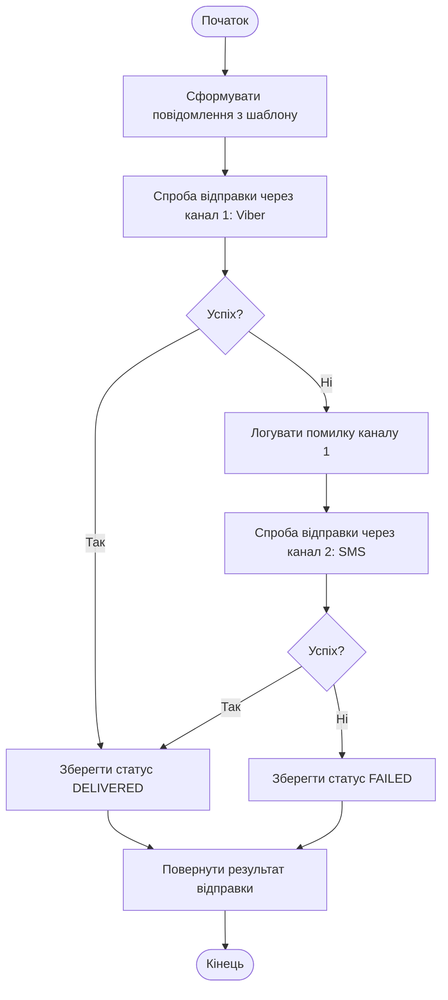
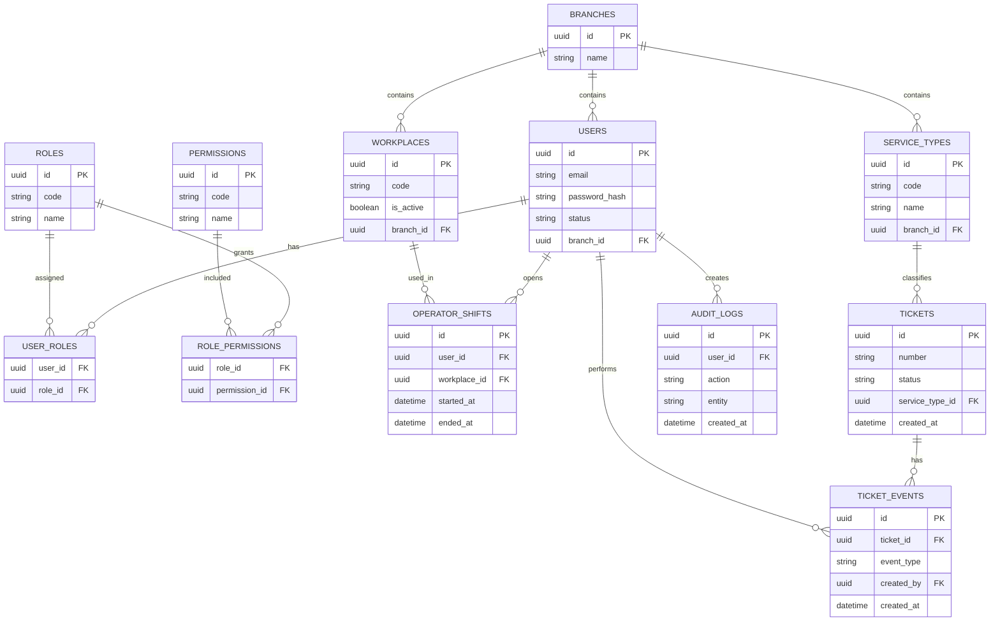
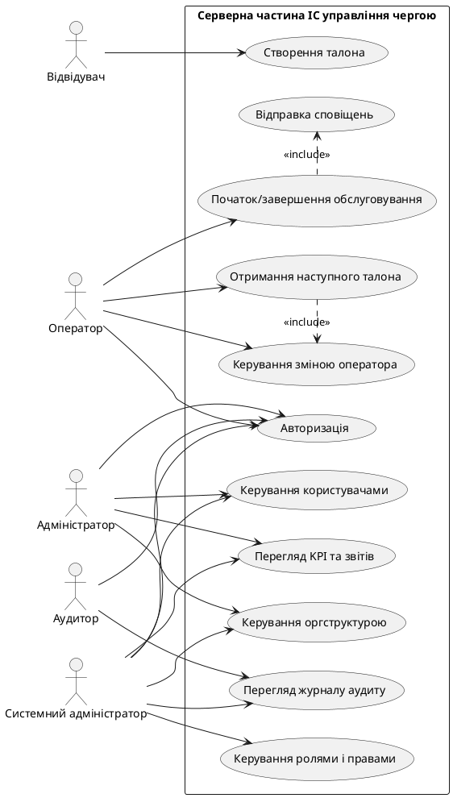

# Звіт
## Тема: Розробка серверної частини для інформаційної системи управління чергами

**Студент(ка):** [ПІБ]  
**Група:** [Група]  
**Спеціальність:** [Спеціальність]  
**Керівник:** [ПІБ керівника]  
**Рік:** 2026

---

## Зміст

1. Вступ  
2. Аналіз предметної області та постановка задачі  
3. Проєктування серверної частини системи  
4. Реалізація бекенду  
5. Тестування та верифікація  
6. Висновки  
7. Список використаних джерел  
8. Додатки

---

## 1. Вступ

У сучасних сервісних організаціях (банки, ЦНАП, медичні заклади, приватні компанії) ефективне керування потоком відвідувачів напряму впливає на якість обслуговування, середній час очікування та задоволеність клієнтів. Традиційні підходи до організації черги часто не забезпечують прозорості, оперативного контролю й аналітики.

Метою даної роботи є розробка серверної частини інформаційної системи управління чергами, яка забезпечує:
- централізоване керування чергою;
- авторизацію та розмежування доступів;
- підтримку основних операцій з талонами;
- взаємодію з фронтенд-клієнтами та публічними дисплеями;
- збір аналітики й аудит дій користувачів.

### 1.1. Об'єкт і предмет дослідження

**Об'єкт дослідження:** процеси електронного керування чергою у багаторівневій організаційній структурі.  
**Предмет дослідження:** методи і засоби побудови серверної частини системи управління чергами на базі сучасного веб-стека.

### 1.2. Завдання роботи

Для досягнення мети було сформульовано такі завдання:
- проаналізувати вимоги до системи;
- спроєктувати архітектуру серверної частини;
- реалізувати REST API для ключових бізнес-процесів;
- забезпечити механізми безпеки (JWT, ролі, доступ за областю відповідальності);
- реалізувати журналювання дій та аналітичні звіти;
- виконати тестування коректності основних сценаріїв.

---

## 2. Аналіз предметної області та постановка задачі

### 2.1. Функціональні вимоги

Система повинна підтримувати:
- автентифікацію користувачів і керування сесіями;
- ведення довідників організаційної структури (країна, місто, район, філія);
- керування користувачами, ролями та правами;
- керування робочими місцями операторів і змінами;
- повний життєвий цикл талона (створення, виклик, початок обслуговування, завершення, скасування, перенаправлення);
- керування шаблонами сповіщень та відправками;
- видачу даних для публічних екранів (display);
- формування аналітичних звітів і KPI;
- аудит дій у системі.

### 2.2. Нефункціональні вимоги

До серверної частини висуваються такі вимоги:
- масштабованість за рахунок модульної архітектури;
- надійність збереження даних у PostgreSQL;
- безпечний доступ до API;
- можливість інтеграції з кількома клієнтами (CRM, kiosk, display);
- розширюваність для нових модулів і сценаріїв.

### 2.3. Обґрунтування вибору технологій

Для реалізації серверної частини обрано:
- **NestJS** як фреймворк для побудови структурованого TypeScript-бекенду;
- **PostgreSQL** як СУБД для транзакційних операцій та аналітичних вибірок;
- **Prisma ORM** для типобезпечного доступу до даних і міграцій;
- **JWT** для авторизації користувачів.

Обраний стек забезпечує високу продуктивність розробки, підтримуваність коду та надійну роботу API.

---

## 3. Проєктування серверної частини системи

### 3.1. Архітектурний підхід

Реалізовано модульну архітектуру, у якій кожна предметна область винесена в окремий модуль. Це знижує зв'язність і спрощує тестування.

Ключові модулі:
- Auth;
- Users;
- Roles & Permissions;
- Org Structure;
- Workplaces;
- Tickets;
- Notifications;
- Display;
- Analytics;
- Audit;
- System.

### 3.2. Логічна модель предметної області

Базові сутності системи:
- користувач (User);
- роль/дозвіл (Role, Permission);
- організаційні одиниці (Country, City, District, Branch);
- робоче місце (Workplace);
- зміна оператора (OperatorShift);
- тип послуги (ServiceType);
- талон (Ticket);
- події талона (TicketEvent);
- шаблони сповіщень (NotificationTemplate);
- записи аудиту (AuditLog).

Зв'язки між сутностями дозволяють реалізувати бізнес-процеси формування, просування й контролю черги.

### 3.3. Проєктування API

API побудовано за REST-підходом з єдиним префіксом `api/v1`. Реалізовано групи endpoint-ів:
- автентифікація: `auth/login`, `auth/refresh`, `auth/logout`;
- користувачі та доступи;
- структура організації;
- робочі місця та зміни;
- керування талонами;
- повідомлення;
- публічні endpoint-и для display/kiosk;
- аналітика та системні endpoint-и.

### 3.4. Безпека

У серверній частині реалізовано:
- JWT-доступ до захищених маршрутів;
- рольову модель доступу (RBAC);
- контекстні обмеження доступу за територіальною структурою (ABAC-підхід);
- журналювання критичних дій користувачів.

---

## 4. Реалізація бекенду

### 4.1. Реалізація модулів автентифікації та користувачів

Модуль автентифікації забезпечує:
- перевірку облікових даних;
- видачу access/refresh токенів;
- оновлення токена;
- завершення сесії.

Модуль користувачів реалізує:
- перегляд списку користувачів;
- створення облікових записів;
- редагування профілю;
- деактивацію;
- скидання пароля.

### 4.2. Реалізація процесу керування чергою

Життєвий цикл талона реалізовано через endpoint-и:
- створення талона;
- отримання поточного/наступного талона;
- виклик клієнта;
- початок обслуговування;
- завершення;
- скасування;
- перенаправлення.

Усі стани фіксуються у подіях талона, що забезпечує прозору історію обробки й подальший аналіз.

### 4.3. Робота з робочими місцями та змінами

Оператор перед обслуговуванням відкриває зміну на доступному робочому місці. Це дозволяє:
- контролювати доступність операторів;
- коректно призначати наступний талон;
- формувати метрики ефективності по змінах.

### 4.4. Реалізація сповіщень

Підсистема сповіщень підтримує:
- керування шаблонами;
- тестові відправки;
- перевірку статусу доставки;
- fallback-стратегію (наприклад, Viber -> SMS у випадку помилки).

### 4.5. Аналітика та аудит

Аналітичні endpoint-и надають:
- KPI-зведення;
- дані для дашборду;
- показники часу очікування та обслуговування;
- рейтинг операторів;
- експорт даних.

Аудит фіксує дії користувачів для контролю безпеки й розслідування інцидентів.

---

## 5. Тестування та верифікація

### 5.1. Підготовка тестового середовища

Для перевірки роботи бекенду виконано:
- налаштування `DATABASE_URL`;
- запуск міграцій Prisma;
- заповнення початкових даних (`seed`);
- запуск застосунку у dev-режимі.

### 5.2. Smoke-тест ключового бізнес-сценарію

Проведено перевірку типового сценарію:
1. Вхід в систему як sysadmin.
2. Отримання організаційної структури та доступних робочих місць.
3. Старт зміни оператора.
4. Отримання доступних послуг.
5. Створення талона.
6. Взяття наступного талона.
7. Початок і завершення обслуговування.
8. Перевірка подій талона.
9. Перевірка доставки сповіщення.

Результати тестування підтвердили коректність реалізованих endpoint-ів і узгодженість станів талона.

### 5.3. Переваги реалізованого рішення

- модульна структура коду;
- чітке розмежування відповідальностей;
- типобезпечна робота з БД;
- підтримка аналітики та аудиту;
- готовність до подальшого масштабування.

---

## 6. Висновки

У межах роботи реалізовано серверну частину інформаційної системи управління чергами на базі NestJS, PostgreSQL та Prisma. Сформовано API для повного циклу обробки талонів, керування користувачами, ролями, організаційною структурою, робочими місцями, сповіщеннями, аналітикою та аудитом.

Практичне тестування основних сценаріїв підтвердило працездатність і цілісність реалізованої системи. Запропоноване рішення може бути використане як основа для подальшого розширення функціоналу, інтеграції з додатковими каналами комунікації, а також впровадження у реальні сервісні організації.

---

## 7. Список використаних джерел

1. NestJS Documentation. URL: https://docs.nestjs.com/  
2. Prisma Documentation. URL: https://www.prisma.io/docs/  
3. PostgreSQL Documentation. URL: https://www.postgresql.org/docs/  
4. JWT Introduction (RFC 7519). URL: https://www.rfc-editor.org/rfc/rfc7519  
5. OWASP API Security Top 10. URL: https://owasp.org/www-project-api-security/

---

## 8. Додатки

### Додаток А. Ключові endpoint-и серверної частини

| Модуль | Метод | Endpoint | Призначення |
|---|---|---|---|
| Auth | POST | `/api/v1/auth/login` | Автентифікація користувача, видача access/refresh токенів |
| Auth | POST | `/api/v1/auth/refresh` | Оновлення access-токена |
| Org Structure | GET | `/api/v1/org/tree` | Отримання дерева оргструктури |
| Workplaces | GET | `/api/v1/workplaces/my-available` | Доступні робочі місця для оператора |
| Queue Orchestrator | POST | `/api/v1/operator-shifts/start` | Відкриття зміни оператора |
| Tickets | POST | `/api/v1/tickets` | Створення талона |
| Tickets | POST | `/api/v1/tickets/next` | Отримання наступного талона в обробку |
| Tickets | POST | `/api/v1/tickets/:ticketId/start` | Початок обслуговування талона |
| Tickets | POST | `/api/v1/tickets/:ticketId/complete` | Завершення обслуговування талона |
| Tickets | GET | `/api/v1/tickets/:ticketId/events` | Перегляд історії подій талона |
| Analytics | GET | `/api/v1/analytics/kpi-summary` | KPI-зведення для дашборду |

### Додаток Б. Напрями подальшого розвитку

- інтеграція push-каналів повідомлень (web push/mobile push);
- розширення ролей і ABAC-політик доступу;
- кешування аналітичних запитів (Redis);
- контейнеризація та CI/CD-пайплайн;
- розширення покриття integration/e2e тестами.

### Додаток В. Матриця ролей і базових дозволів

| Операція | SYSADMIN | ADMIN_BRANCH | OPERATOR | AUDITOR |
|---|---|---|---|---|
| Керування користувачами | Так | Так (у межах філії) | Ні | Ні |
| Керування ролями та правами | Так | Частково | Ні | Ні |
| Керування оргструктурою | Так | Частково | Ні | Ні |
| Старт/завершення зміни | Так | Так | Так | Ні |
| Створення/обробка талонів | Так | Так | Так | Ні |
| Перегляд аналітики | Так | Так | Частково | Так |
| Перегляд аудиту | Так | Частково | Ні | Так |

Примітка: для ролей застосовуються додаткові контекстні обмеження доступу за територіальною структурою (країна/місто/район/філія).

### Додаток Г. Фрагмент логічної схеми БД

| Таблиця | Ключові поля | Зв'язки |
|---|---|---|
| `users` | `id`, `email`, `status`, `branch_id` | `branch_id -> branches.id` |
| `roles` | `id`, `code`, `name` | M:N з `users` через `user_roles` |
| `permissions` | `id`, `code`, `name` | M:N з `roles` через `role_permissions` |
| `workplaces` | `id`, `code`, `branch_id`, `is_active` | `branch_id -> branches.id` |
| `operator_shifts` | `id`, `user_id`, `workplace_id`, `started_at`, `ended_at` | `user_id -> users.id`, `workplace_id -> workplaces.id` |
| `service_types` | `id`, `code`, `name`, `branch_id` | `branch_id -> branches.id` |
| `tickets` | `id`, `number`, `status`, `service_type_id`, `created_at` | `service_type_id -> service_types.id` |
| `ticket_events` | `id`, `ticket_id`, `event_type`, `created_by`, `created_at` | `ticket_id -> tickets.id`, `created_by -> users.id` |
| `audit_logs` | `id`, `user_id`, `action`, `entity`, `created_at` | `user_id -> users.id` |

Скорочена ER-логіка: `Branch -> Workplaces`, `Branch -> ServiceTypes`, `ServiceType -> Tickets`, `Ticket -> TicketEvents`, `User -> OperatorShift`, `User -> AuditLog`.

### Додаток Д. Блок-схеми алгоритмів програмних модулів

#### Д.1. Алгоритм автентифікації (Auth module)

#### Д.2. Алгоритм видачі наступного талона (Queue Orchestrator)

#### Д.3. Алгоритм відправки сповіщення з fallback (Notifications)

### Додаток Е. ER-діаграма серверної частини

### Додаток Ж. Діаграма прецедентів (Use Case Diagram)

Примітка: для рендерингу діаграми прецедентів у середовищах без підтримки PlantUML допускається використання будь-якого UML-редактора (StarUML, Visual Paradigm, draw.io UML).
